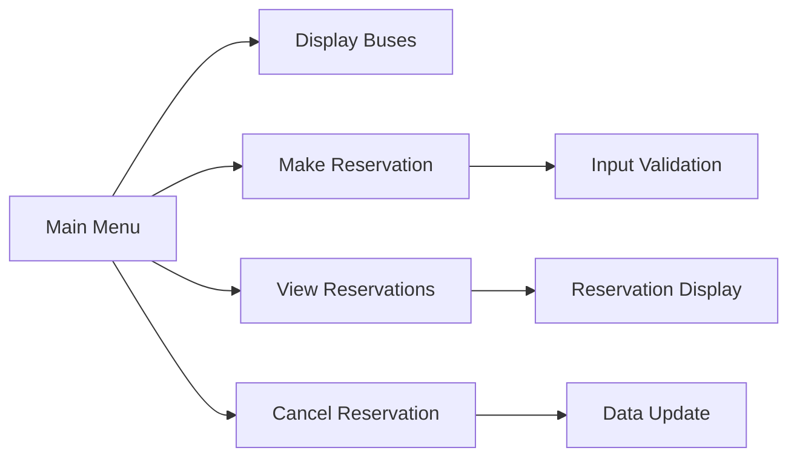

# 🚌 Bus Reservation System - C++ Project

> Console-based reservation management system for St. Mary's University Programming Fundamentals<

## 👥 Team Members
| Name              | ID            | GitHub Profile             |
|-------------------|---------------|----------------------------|
| Bereket Shimelis  | RCD/0238/2017 | [@beki8050](https://github.com/beki8050) |
| Bruk Yonas        | RCD/0245/2017 | [@Whoisyourdaddy1962](https://github.com/Whoisyourdaddy1962) |
| Daniel Worede     | RCD/0246/2017 | [@Wagone61](https://github.com/Wagone61) |
| Helina Abera      | RCD/1825/2017 | [@Linatera](https://github.com/Linatera) |
| Habtamu Seleshe   | RCD/0257/2017 | [@habtamu-m](https://github.com/habtamu-m) |
| Kenenisa Jaleta   | RCD/0263/2017 | [@milto14](https://github.com/milto14) |
| Natnael Alemayehu | RCD/0269/2017 | [@Nati2374](https://github.com/Nati2374) |
| Abraham Berihun   | RCD/2546/2017 | [@AbrhamBerihun](https://github.com/AbrhamBerihun) |

## 📝 Project Overview
A C++ console application demonstrating fundamental programming concepts through a bus seat reservation system. The program manages multiple buses with seat reservations using arrays and procedural programming.

## ✨ Key Features
- **Bus Management**  
  Track up to 10 buses with:
  - Bus numbers
  - Destinations
  - Total seats
  - Booked seats
- **Reservation System**  
  - Make new reservations
  - View existing reservations
  - Cancel reservations
- **Input Validation**  
  Enforce seat limits and reservation constraints
- **Console Interface**  
  User-friendly menu navigation

## 🧱 System Architecture


## 📊 Data Structures
| Variable Name          | Type       | Description                      | Size        |
|------------------------|------------|----------------------------------|-------------|
| `busNumbers`           | `int[]`    | Unique bus identifiers           | 10 buses    |
| `destinations`         | `string[]` | Destination cities               | 10 buses    |
| `totalSeats`           | `int[]`    | Total seats per bus              | 10 buses    |
| `bookedSeats`          | `int[]`    | Occupied seats per bus           | 10 buses    |
| `reservationNames`     | `string[][]`| Passenger names                 | 10×50 array |
| `reservationSeats`     | `int[][]`  | Reserved seat counts             | 10×50 array |
| `reservationCounts`    | `int[]`    | Active reservations per bus      | 10 buses    |

## 🛠️ Core Functions
| Function               | Description                                |
|------------------------|--------------------------------------------|
| `displayBuses()`       | Shows all buses with seat availability     |
| `makeReservation()`    | Books seats for passenger on specific bus  |
| `viewReservations()`   | Displays all reservations grouped by bus   |
| `cancelReservation()`  | Removes booking by passenger name          |

## 🖥️ Sample Interface
```text
=== Bus Reservation System ===
1. Display Available Buses
2. Make a Reservation
3. View Reservations
4. Cancel Reservation
5. Exit

Enter your choice: 2

Enter bus number: 101
Passenger name: John Doe
Seats required: 3
Reservation successful!
```

## ⚠️ Academic Constraints
- **No file I/O** (Data not persistent across runs)
- **No STL containers** (Only basic arrays used)
- **No OOP** (Purely procedural implementation)
- **No dynamic memory** (Static array sizes only)

## 📌 Key Notes
- Passenger names limited to single words
- Maximum 10 buses supported
- Maximum 50 reservations per bus
- Seat reservations are first-come-first-served
- Designed for easy future extension

## 🔍 How to Use
1. Clone repository:
   ```bash
   git clone https://github.com/your-repo/bus-reservation.git
   ```
2. Compile using C++ compiler:
   ```bash
   g++ main.cpp -o reservation
   ```
3. Run executable:
   ```bash
   ./reservation
   ```

## 📜 License
Academic Project - © 2023 St. Mary's University
```
